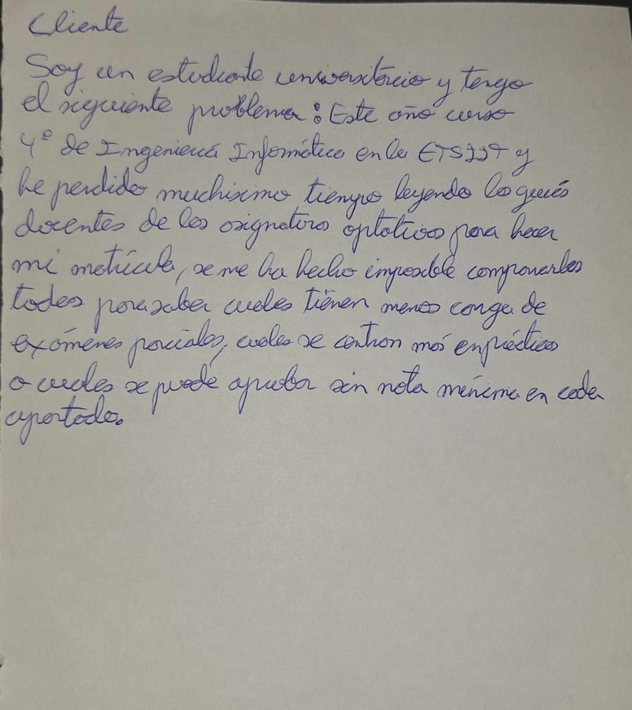

# Analizador de Guías Docentes: Elección de Optativas

## Descripción del Problema
Cada año, al realizar la automatrícula, los estudiantes de los últimos cursos de ingeniería informática de la ETSIIT tenemos una gran oferta de asignaturas optativas que podemos elegir. Cada alumno tiene un perfil y unos gustos distintos: unos buscan asignaturas donde el mayor peso de la nota caiga en la parte práctica, otros prefieren evitar los exámenes finales, otros necesitan saber si existen condiciones de "nota mínima" o asistencia obligatoria, etc.

El problema es que toda esta información está dentro de guías docentes en PDF y comparar las opciones disponibles para encontrar las que más le guste a cada uno de los estudiantes necesita que se descarguen todos los documentos y que revisen cada una de las páginas para encontrar el apartado de evaluación. Este proceso consume tanto tiempo que hace imposible analizar todas las opciones, lo que provoca que los alumnos se matriculen a ciegas o basándose solo en el nombre de la asignatura.

## Validación (Tarjeta de Rol)

## ¿Qué datos existen ya?
Toda la información necesaria para resolver este problema ya existe de forma pública en los documentos oficiales de la universidad. Por lo que, para solucionar este problema no se pedirá que el estudiante inserte los datos de las asignaturas a mano.

## Necesidad de Lógica de Negocio
Este problema no se soluciona simplemente guardando y buscando archivos por título. Como la información de los PDF está diseñada para lectura humana y no estructurada en una base de datos, la solución requiere interpretar texto y realizar cálculos:

1. **Extracción:** Es necesario escanear el texto de las guías docentes que se encuentran en el servidor.
2. **Análisis:** Usando diferentes reglas, se debe localizar la metodología y la evaluación, cogiendo las distintas variables (porcentajes de teoría/práctica, menciones a trabajos, notas mínimas, etc.) y transformando texto en datos estructurados.
3. **Cálculo y Generación de resultados:** El programa coge todos esos datos extraídos y los cruza con las preferencias personales de cada estudiante (ej. "dar máxima prioridad a evaluación continua"). Con esa información, calcula una puntuación para cada asignatura y te devuelve una lista ordenada con las optativas que mejor encajan con lo que buscas.

## Configuración del Entorno
La justificación y capturas de pantalla de la configuración del repositorio (Git, claves SSH y perfil) se encuentran en el siguiente archivo:
[Ver configuración del repositorio](doc/configuracion.md)
