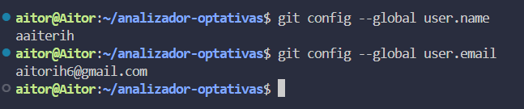
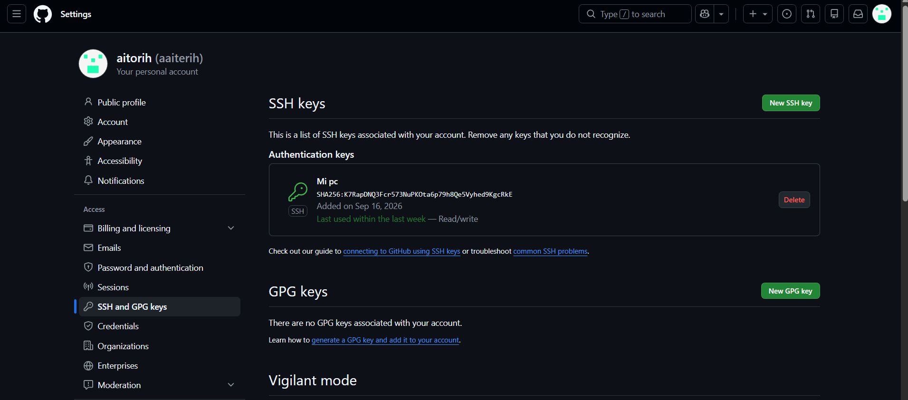

# Configuración del Entorno

## 1. Identidad en Git 
Aquí se ve que he configurado mi nombre de usuario y mi correo electrónico en la terminal.

## 2. Conexión segura con SSH
Y esta es la captura de los ajustes de mi cuenta de GitHub, donde se ve que ya tengo vinculada mi clave pública SSH, evitando usar los enlaces HTTPS:

